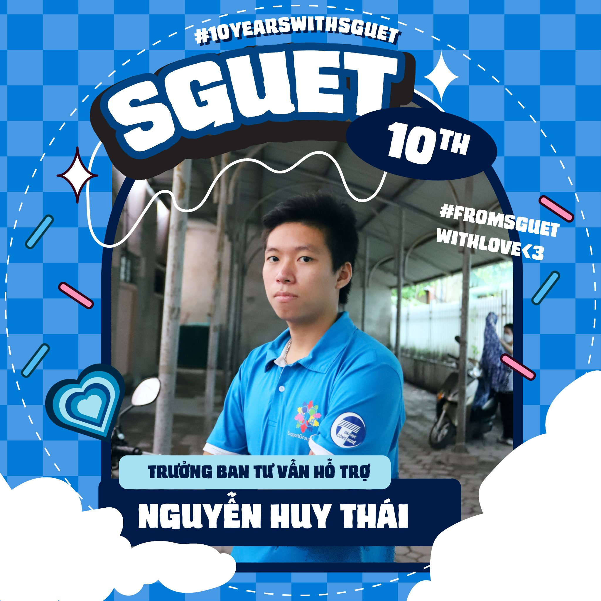

### Hi there, I'm Nguyen Huy Thai 👋
- 🌱 I'm pursuing Bachelor's Degree in Information Technology at [University of Engineering and Technology (UET-VNU)](https://uet.vnu.edu.vn/)
- 🔭 I’m currently studying Bioinformatics & Machine Learning.
- 📫 Contact me through: [nguyenhuythai15@.gmail.com](mailto:nguyenhuythai15@gmail.com)
- ⚡ Favourite quote: "The difference between ordinary and extraordinary is that little extra" – Jimmy Johnson

#### Connect with me via: 

|  |  |
|------------------------------------------------------| ------------- |

