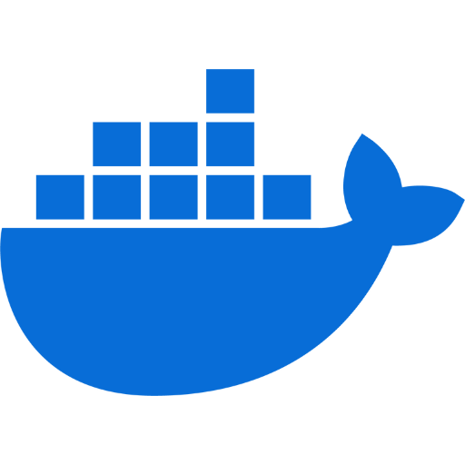

---
### 👩‍💻 About me:
- 🌱 I'm pursuing Bachelor's Degree in Information Technology at [University of Engineering and Technology (UET-VNU)](https://uet.vnu.edu.vn/).
- 🔭 I’m currently working in the field of Cloud Computing & DevOps.
- ⚡ Favourite quote: "Chances are always for those who are well prepared".
- 💬 Feel free to ask me about anything about my work or new opportunities.
- 📫 Contact me through: [nguyenhuythai15@gmail.com](mailto:nguyenhuythai15@gmail.com).

### 🛠 Languages & tools:

          
  

    
    
    
    
    
    
    
    
    
    
    
    
    
    
    
    
    
    
        
  

  

### ✉ Connect with me via: 

&nbsp;

|  |  |
|------------------------------------------------------| ------------- |

